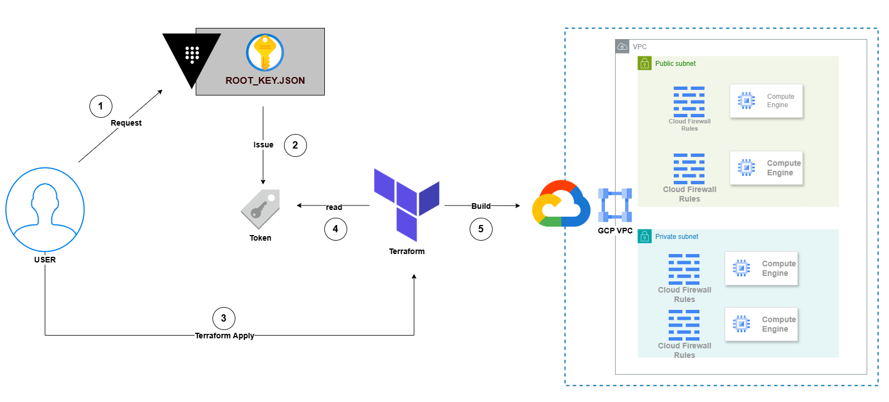

# Vault + Terraform 操作 GCP 服務帳號指南

本專案示範如何使用 HashiCorp Vault 管理 GCP 服務帳號(Service Account)憑證,並透過 Terraform 部署基礎設施。這種做法可避免長期金鑰外洩風險,實現更安全的雲端資源管理。

---

## 📚 參考資源

- [利用 Vault 部署 GCP Service Account(影片)](https://www.youtube.com/watch?v=tvgTGJjRNA8)
- [Vault + GCP + Terraform 整合操作(影片)](https://www.youtube.com/watch?v=mxlNw9rZYcM)

---

## 🏗️ 架構說明[


### 核心概念

本專案採用三層式安全架構:

1. **Root SA(根服務帳號)**: 儲存在 Vault 中,擁有高權限,僅由 Vault 內部使用
2. **Vault Roleset**: 定義臨時帳號的權限範圍和生命週期
3. **臨時 Access Token**: 由 Vault 動態產生,有效期短

### 安全優勢

- ✅ **零金鑰外洩風險**: 永久私鑰鎖在 Vault 內部,開發人員無法取得
- ✅ **自動過期機制**: 所有憑證皆為短期有效,降低被盜用的影響範圍
- ✅ **集中化管理**: 所有權限控制透過 Vault 統一管理
- ✅ **審計追蹤**: Vault 記錄所有憑證發放歷程

---

## 🚀 部署步驟
## 📒 環境需求
- Windows OS
- Vault、Terraform、Google Cloud SDK (gcloud)
- 已建立的 GCP 專案
## 📒 前置安裝
1. **檢查 Winget（Windows 內建，通常無需安裝）**
在 PowerShell 中輸入以下指令確認工具是否可用：
```powershell
winget --version
```
*若無法執行，請至 Microsoft Store 更新「應用程式安裝程式」。*

2. **安裝 Vault, Terraform 與 Google Cloud SDK**
```powershell
winget install HashiCorp.Vault
winget install HashiCorp.Terraform
winget install Google.CloudSDK
```
3. **重啟 Terminal 後執行驗證：**
```powershell
vault --version; terraform --version; gcloud --version
```

### A. GCP 端設定

#### 步驟 1: 建立 Root Service Account

1. 登入 [GCP Console](https://console.cloud.google.com)
2. 開啟 Cloud Shell
3. 執行 `./scripts/create_root_sa.sh` 內的指令建立並下載 Root SA 金鑰:

```bash
# 設定環境變數(可自訂名稱)
export ROOT_SA_NAME="root-sa-by-vault"
export ROOT_KEY_NAME="root_sa"
export ROOT_ROLE="owner"

# 取得專案 ID
p=$(gcloud config get-value project)
e="${ROOT_SA_NAME}@$p.iam.gserviceaccount.com"

# 建立 Service Account
gcloud iam service-accounts create $ROOT_SA_NAME || true

# 等待 SA 建立完成
sleep 5 

# 授予專案 Owner 權限
gcloud projects add-iam-policy-binding $p \
  --member="serviceAccount:$e" \
  --role="roles/$ROOT_ROLE"

# 產生並下載金鑰檔
gcloud iam service-accounts keys create $ROOT_KEY_NAME.json \
  --iam-account=$e

# 下載到本地
cloudshell download $ROOT_KEY_NAME.json
```

#### 步驟 2: 儲存金鑰檔

* 將下載的 `root_sa.json` 放置到專案目錄的 `./keys/root_sa.json` 路徑下。

#### 步驟 3: 啟用必要的 GCP API

* 確認已啟用以下兩個 API([參考影片 11:48](https://www.youtube.com/watch?v=tvgTGJjRNA8)):
  1. Identity and Access Management (IAM) API
  2. Cloud Resource Manager API

若尚未啟用,可在 Cloud Shell 執行:

```bash
gcloud services enable \
  iam.googleapis.com \
  cloudresourcemanager.googleapis.com
```

---

### B. 本機端設定

#### 步驟 1: 啟動 Vault 開發伺服器

```bash
vault server -dev

# 自訂 root token(選用):
# vault server -dev-root-token-id="your-custom-token"
```

*啟動後會顯示類似以下資訊,**請妥善保存**:*

```
PowerShell 環境變數設定:
    $env:VAULT_ADDR="http://127.0.0.1:8200"

cmd.exe 環境變數設定:
    set VAULT_ADDR=http://127.0.0.1:8200

Unseal Key: <YOUR_UNSEAL_TOKEN>.............................
Root Token: <YOUR_VAULT_TOKEN> (hvs..................)
```

>### ⚠️ **重要**: 請記錄 `Unseal Key` 和 `Root Token`,這些資訊在生產環境中至關重要。

---

#### 步驟 2: 設定環境變數

##### 2.1 編輯 `./config.ps1` 檔案

```powershell
# Vault 伺服器位址
$env:VAULT_ADDR = "http://127.0.0.1:8200"

# Vault Root Token
$env:VAULT_TOKEN = "{剛剛拿到的ROOT TOKEN}"

# Service Account 名稱(建議格式: {使用者}-{建立方式}-{用途})
$env:TF_VAR_sa_name = "{用來執行Terraform的SA名稱}"

# 選擇Secret Type
$env:SECRET_TYPE =  "access_token"  # or "service_account_key"
    # `secret_type="access_token"`: 產生 OAuth2 存取令牌(而非永久金鑰)
    # `secret_type="service_account_key"`: 產生 OAuth2 存取金鑰

# 從 root_sa.json 自動提取專案 ID
$env:PROJECT_ID = (Get-Content "./keys/root_sa.json" | ConvertFrom-Json).project_id
```

> 💡 **說明**: `TF_VAR_` 前綴讓 Terraform 能自動讀取環境變數。

##### 2.2 載入環境變數

* 開啟新的 PowerShell 視窗,執行:

```powershell
. .\config.ps1
```

##### 2.3 啟用 Vault GCP Secrets Engine

```powershell
# 登入 Vault
vault login $env:VAULT_TOKEN

# 啟用 GCP secrets engine
vault secrets enable gcp

# 驗證是否啟用成功
vault secrets list
```

---

#### 步驟 3: 將 Root SA 金鑰寫入 Vault

```powershell
# 寫入 Root SA 憑證到 Vault
vault write gcp/config `
  credentials=@./keys/root_sa.json `
  ttl=30m `
  max_ttl=2h

# 驗證設定
vault read gcp/config
```


- `ttl=30m`: 產生的 Token 初始有效時間為 30 分鐘
- `max_ttl=2h`: Token 最長可續租至 2 小時

> ⚠️ **注意**: 
> - GCP Access Token 預設有效期為 1 小時,最長可延至 12 小時
> - 詳見 [Vault 文件](https://developer.hashicorp.com/vault/docs/secrets/gcp) 與 [Google 文件](https://docs.cloud.google.com/iam/docs/create-short-lived-credentials-delegated?hl=zh-tw)

> ### 🔒 **備份建議**: 定期執行 Vault Snapshot,以防 Root Key 意外遺失。

---

#### 步驟 4: 建立 Vault Roleset
4.1 建立`access_token` Roleset 
```powershell
vault write gcp/roleset/$env:TF_VAR_sa_name `
  project=$env:PROJECT_ID `
  secret_type=$env:SECRET_TYPE `
  token_scopes="https://www.googleapis.com/auth/cloud-platform" `
  bindings="resource \`"//cloudresourcemanager.googleapis.com/projects/$env:PROJECT_ID\`" { roles = [\`"roles/editor\`"] }"
```

**參數說明**:
- `token_scopes`: 定義 Token 的權限範圍(此處為完整雲端平台權限)
- `bindings`: 指定臨時帳號在專案中的權限

#### 步驟 5:⚠️ 刪除`./keys/root_sa.json`
* 這個步驟能讓接下來的操作更有感vault的能力
**刪除 Roleset**(若需要):
```powershell
vault delete gcp/roleset/$env:TF_VAR_sa_name
```
> ⚠️ 刪除 Roleset 會同步刪除 GCP 中對應的 Service Account。

---

#### 步驟 5: 驗證與測試

##### 檢視 Roleset 設定

```bash
# 查看 Roleset 設定
vault read gcp/roleset/$env:TF_VAR_sa_name


# A.如果是 "access_token" ,每次執行 vault read 時，Vault 都會向 GCP 申請一個「全新」的 Token
vault read gcp/token/$env:TF_VAR_sa_name
  # 1. Vault 收到你的請求。
  # 2. Vault 即時連線到 Google Cloud API。
  # 3. Google Cloud 產生一個有效期為 3600 秒（60 分鐘） 的全新 Access Token。
  # 4. Vault 將這個新 Token 傳回給你。


# B.如果是 "service_account_key" ,每次執行 vault read 時，Vault 都會向 GCP 申請一個「全新」的 金鑰
vault read gcp/roleset/$env:TF_VAR_sa_name/key
```
##### 常用 Vault 路徑說明

| 路徑 | 用途 |
|------|------|
| `gcp/config` | 檢視或設定 Root SA 與全域 TTL |
| `gcp/token/:roleset_name` | 索取臨時 OAuth2 Access Token |
| `gcp/key/:roleset_name` | 索取臨時 SA JSON 金鑰(需 Roleset 類型為 `service_account_key`) |
| `gcp/roleset/` | 列出所有已建立的 Roleset |
| `gcp/static-account/:name` | 管理靜態 SA 並自動輪替金鑰 |
| `sys/leases/lookup/gcp/` | 追蹤已發放憑證的租約狀態 |

---

### C. 部署 Terraform 基礎設施

#### 步驟 1: 進入 Terraform 工作目錄

```bash
cd ./gcp_infra/
```

#### 💫步驟 2: 檢視設定檔 (重要)

* 確認 `main.tf` 和 `terraform.tfvars` 的內容符合您的需求。
    * 要先手動更正 `terraform.tfvars` 裡面的 `project_id` 
* 確認 `_provider.tf` 要用哪一個
  * 1.如果 `secret_type是`是`access_token`就用`_provider_access_token.tf`
  * 2.如果 `secret_type是`是`service_account_key`就用`_provider_service_account_key.tf`


#### 步驟 3: 初始化與驗證

```powershell
# 初始化 Terraform
terraform init

# 檢視部署計畫
terraform plan
```

#### 步驟 4: 部署資源

```powershell
terraform apply -auto-approve
```
會出現類似以下的 `output`：

```sh
infra = {
    gcloud_login_command = <<-EOT
    
      gcloud auth login # 要輸入帳號密碼登入IAM帳號
      gcloud config set project ${local.project_id} 
      gcloud compute ssh ${module.gce.output.name} --zone=${module.gce.output.zone} --quiet   
  
    EOT
}

```
接下來輪流輸入三行指令就可以登入了，第一個指令記得要登入所用的帳號

#### 步驟 5: 清理資源

```powershell
terraform destroy -auto-approve
```

---

## 🔐 運作原理詳解

### 兩階段授權機制

#### 階段一: 授權 Vault(gcp/config)

```bash
vault write gcp/config credentials=@./keys/root_sa.json
```

**作用**: 告訴 Vault「當你需要代表我操作 GCP 時,請使用這個 Root SA 的身分」。

#### 階段二: 定義權限模板(gcp/roleset)

```bash
vault write gcp/roleset/my-sa project=my-project ...
```

**作用**: 建立一個權限模板,定義未來產生的臨時帳號應該:
- 屬於哪個專案
- 擁有什麼權限
- Token 的有效範圍

### Token 取得流程

1. 使用者向 Vault 請求: `vault read gcp/token/my-sa`
2. Vault 使用 Root SA 向 GCP 建立臨時 Service Account
3. Vault 取得該 SA 的短期 OAuth2 Access Token
4. Vault 將 Token 回傳給使用者
5. 使用者使用 Token 操作 GCP 資源

### **重點**:
- 使用者**永遠拿不到** Service Account 的永久金鑰
- 使用者**只能取得**有時效性的 Access Token
- Root SA 金鑰**完全鎖在** Vault 內部


## 📝 最佳實踐建議

1. **定期備份**: 設定自動化 Vault Snapshot 排程
2. **最小權限原則**: Roleset 僅授予必要權限(避免使用 Owner)
3. **監控稽核**: 啟用 Vault audit log 追蹤所有操作
4. **環境隔離**: 生產與開發環境使用不同的 Vault 實例
5. **Token 續租**: 在 CI/CD 流程中實作自動續租機制

---

## 🛠️ 故障排除
### Vault 無法連線 => 檢查環境變數是否正確設定:
```powershell
echo $env:VAULT_ADDR
echo $env:VAULT_TOKEN
```
### GCP API 未啟用 => 執行以下指令確認 API 狀態:
```bash
gcloud services list --enabled
```
### Token 無法取得 => 檢查 Roleset 是否存在:
```bash
vault list gcp/roleset
```
